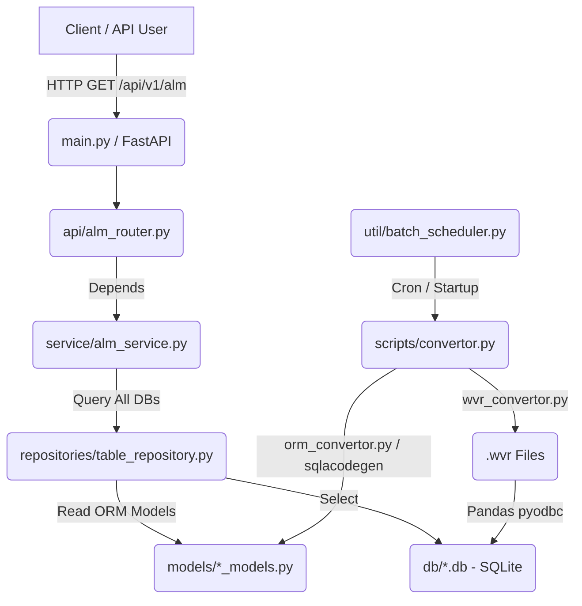

# WVR Lite (WVR Data Migration & REST API Service)

`WVR Lite` is a framework designed to migrate calculation result files (`.wvr` files) from R³S, an actuarial and ALM (Asset Liability Management) system, into a lightweight file-based **SQLite (.db)** database. It also provides an **asynchronous REST API service based on FastAPI** to efficiently query data across multiple migrated databases.

This project was designed and developed by an AI agent (Antigravity). For more details, please check the `.agents` directory.

---

## 1. Key Features

- **Automated/Manual Latest Data Detection**: Automatically scans and identifies the latest `.wvr` files that have been modified or updated within the last 24 hours to designate them as migration targets.
- **High-Speed Parallel Data Migration**:
  - Establishes virtual connections to relational `.wvr` result engines using `pyodbc`.
  - Integrates `ProcessPoolExecutor` multiprocessing with `pandas` to extract data from multiple tables in parallel and perform high-speed bulk dumps (`to_sql`) into SQLite `.db` files.
- **Automated ORM Code Reverse Engineering**:
  - Automatically reverse-engineers Python ORM model codes (`models/*_models.py`) based on SQLAlchemy by analyzing the schema of migrated SQLite DBs using `sqlacodegen`.
- **Batch Scheduling**: Uses `APScheduler` to run a background batch process every day at 3:00 AM, automatically executing the entire pipeline: [.wvr scanning -> SQLite migration -> ORM generation].
- **Asynchronous Multi-DB Query Engine via FastAPI**:
  - Dynamically scans all SQLite databases in the `db/` folder on server startup and keeps database-specific query repositories in memory as singletons.
  - Exposes a REST API endpoint (`GET /api/v1/alm`) that asynchronously fetches and aggregates target tables and columns across all databases, returning them in a single response to the client.

---

## 2. System Architecture & Data Flow



### Data Pipeline (.wvr ➔ SQLite ➔ ORM)
1. **Target Identification**: Scans for `.wvr` files modified within the last 24 hours under the specified `WVR_DIR_PATH` in `.env`.
2. **SQLite DB Conversion**: Reads table data using `pyodbc` and `pandas.read_sql`, processes tables in parallel via multiprocessing, and dumps them into the `db/` directory as SQLite `.db` files.
3. **ORM Model Generation**: Runs a background process with `sqlacodegen` on the newly created SQLite DBs to automatically generate and save Python SQLAlchemy declarative models in the `models/` directory.

---

## 3. Directory Structure

```
wvr_lite/
├── main.py                     # Entry point of the FastAPI REST API server
├── compose.yaml                # Multi-container Docker Compose configuration
├── Dockerfile                  # Lightweight multi-stage Dockerfile based on Alpine Linux
├── pyproject.toml              # Build configurations and project metadata
├── config/                     # Application configurations and dependency management
│   ├── database.py             # Asynchronous SQLite connections (aiosqlite) and pyodbc setup
│   ├── dependencies.py         # Lifespan events (scheduler startup/shutdown) and dependency injections
│   └── environments.py         # .env and OS environment variable parsing and validation
├── api/
│   └── alm_router.py           # REST API endpoint implementation (GET /api/v1/alm)
├── service/
│   └── alm_service.py          # Dynamic DB scanning and parallel asynchronous query aggregation
├── repositories/
│   ├── auto_repository.py      # Abstract repository base for SQLAlchemy sessions
│   └── table_repository.py     # Repository to dynamically build and run queries for arbitrary tables/columns
├── models/                     # Auto-generated SQLAlchemy ORM python models (generated by sqlacodegen)
├── tables/
│   └── mv_distribution_tables.py # Manual declarative ORM models and tables
├── util/
│   ├── batch_scheduler.py      # APScheduler manager to run daily migration batches (3:00 AM)
│   ├── wvr_connector.py        # Utility for pyodbc-based .wvr connections and latest file detection
│   ├── wvr_convertor.py        # Multiprocessing-based .wvr to SQLite converter using Pandas
│   ├── orm_convertor.py        # Automatic ORM generator that spawns sqlacodegen commands
│   └── log_handler.py          # Logging setup handler
└── scripts/
    ├── convertor.py            # [Manual Run] One-click script to run file detection, conversion, and ORM generation
    ├── extractor.ps1           # Guide script to run sqlacodegen manually
    └── docker_runner.ps1       # PowerShell utility to build and run docker containers
```

---

## 4. Tech Stack

- **Language & Runtime**: Python 3.14+
- **API Framework**: FastAPI, Uvicorn, Pydantic
- **ORM / Database Engine**: SQLAlchemy 2.0+, aiosqlite (asynchronous SQLite querying), pyodbc, sqlite3
- **Data Engineering**: Pandas
- **Scheduler**: APScheduler (`AsyncIOScheduler`)
- **Infrastructure / Docker**: Docker, Docker Compose (optimized with multi-stage builds)

---

## 5. Getting Started

### 1) Environment Variables Setup (`.env`)
Create a `.env` file in the project root and specify the path and file names of your `.wvr` files.
```env
WVR_DIR_PATH=C:\workspace\wvr_lite\wvr_source_files     # Directory containing your .wvr files
ALM_WVR_PATH=C:\workspace\wvr_lite\wvr_source_files\ALM_Dashboard_20260424.wvr
SII_WVR_PATH=C:\workspace\wvr_lite\wvr_source_files\SII_Aggregation_Std_Formula_Solo.wvr
```

### 2) Running the Application locally
**Setup Virtual Environment & Install Dependencies:**
```powershell
# Create and activate a virtual environment
python -m venv .venv
.venv\Scripts\activate   # Windows PowerShell
source .venv/bin/activate  # macOS / Linux

# Install dependencies
pip install -r requirements.txt # or 'pip install .'
```

**Execute Manual Migration:**
If you want to manually trigger the migration to scan `.wvr` files, convert them to SQLite databases, and generate the SQLAlchemy models immediately before the scheduler triggers:
```powershell
python scripts/convertor.py
```

**Run API Server:**
```powershell
python main.py
```
- The server will run at `http://localhost:8080`.
- Once started, FastAPI's lifespan events will automatically initiate the background scheduler which runs the automatic migration batch every day at 3:00 AM.
- Access the interactive API docs at `http://localhost:8080/docs` to test querying database tables dynamically.

### 3) Running via Docker
You can package the server and scheduler inside a containerized environment.
```powershell
# Build and run the docker container using utility script
.\scripts\docker_runner.ps1

# Or run via docker compose directly
docker compose up -d --build
```
- The `/app/logs` directory inside the container is mapped (via Volume Mount) to `./logs` on your local machine to keep track of execution logs.

---

## 6. Contributing & Issues
If you encounter any issues or have feature requests, please feel free to open an **Issue** or submit a **Pull Request** in this GitHub repository!

